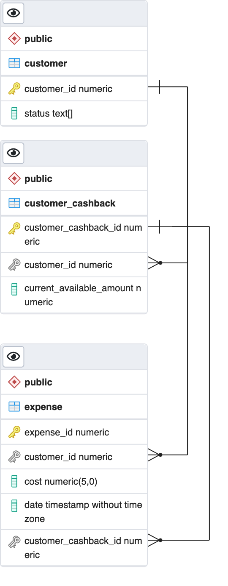

# Cashback service database

Provisioning for cashback database with postgres and containers. 
See an ERD at the end of this document for more details. 

**Technologies**

- PostgreSQL 13.6-alpine3.15 ( Supported in RHBQ 2.2.x )
- Docker/Podman 

**How to run**

```
git clone https://github.com/kmacedovarela/cashback_db.git
cd cashback_db
docker run -it --rm --name postgres -d -e POSTGRES_PASSWORD=postgres -p 6543:5432 -v /tmp/db/psql:/var/lib/postgresql/data --mount type=bind,source=$(pwd)/ddl/cashback_db.sql,target=/docker-entrypoint-initdb.d/cashback_db.sql postgres:13.6-alpine3.15 
```

**Important tips and tricks**

- If you want to start the container and see the output logs, the quickest way is to remove the "-d" parameter (detach);
- Once you start the container, it will store the data in your machine's directory `/tmp/db/psql`. If this directory already exists, the initialization script won't be executed.

**Entity Relationship Diagram**


